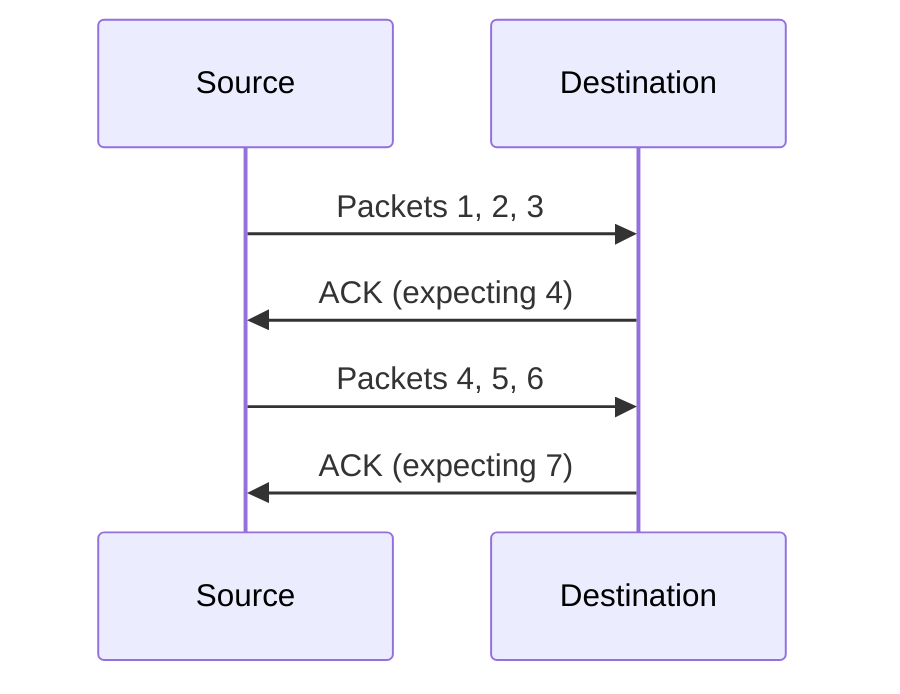

<!-- START doctoc generated TOC please keep comment here to allow auto update -->
<!-- DON'T EDIT THIS SECTION, INSTEAD RE-RUN doctoc TO UPDATE -->
**Table of Contents**  *generated with [DocToc](https://github.com/thlorenz/doctoc)*

- [Transport Layer Protocols: TCP vs UDP](#transport-layer-protocols-tcp-vs-udp)
  - [UDP (User Datagram Protocol)](#udp-user-datagram-protocol)
    - [Key Characteristics](#key-characteristics)
    - [How UDP Works](#how-udp-works)
    - [Transmission Behavior](#transmission-behavior)
    - [Use Cases](#use-cases)
    - [Advantages](#advantages)
  - [TCP (Transmission Control Protocol)](#tcp-transmission-control-protocol)
    - [Key Characteristics](#key-characteristics-1)
    - [How TCP Works](#how-tcp-works)
    - [Reliability Mechanism](#reliability-mechanism)
    - [Adaptive Window Size](#adaptive-window-size)
    - [Use Cases](#use-cases-1)
  - [TCP vs UDP Comparison](#tcp-vs-udp-comparison)
  - [Key Concepts](#key-concepts)
    - [Reliability in Networking Context](#reliability-in-networking-context)
    - [Overhead Explained](#overhead-explained)
  - [Protocol Selection Decision](#protocol-selection-decision)

<!-- END doctoc generated TOC please keep comment here to allow auto update -->

# Transport Layer Protocols: TCP vs UDP

The Transport Layer uses two primary protocols:

- **TCP** (Transmission Control Protocol)
- **UDP** (User Datagram Protocol)

---

## UDP (User Datagram Protocol)

### Key Characteristics

- Used primarily for **streaming** and **real-time communications**
- Minimal overhead for faster transmission
- No reliability guarantees

### How UDP Works

At the transport layer, data is broken into **segments**, each labeled with:

- **Source port** (e.g., random port 5105)
- **Destination port** (e.g., DNS server port 53)

```
Data → Transport Layer → Segments with Port Info
[Segment] Source: 5105 → Destination: 53
```

### Transmission Behavior

- Packets may be **dropped** during transmission
- Packets may arrive **out of order**
- No mechanism to retransmit lost packets
- No worrying about packet delivery

### Use Cases

> [!example] Real-Time Communication In an IP phone conversation, if a few packets are dropped, you probably wouldn't notice unless it's a long stream. The delay from retransmission would be more disruptive than losing a few packets.

> [!example] Streaming Applications Video/audio streaming where slight data loss is acceptable for maintaining real-time flow

### Advantages

- **Speed** - no acknowledgement overhead
- **Efficiency** - minimal protocol overhead
- **Simplicity** - straightforward transmission

---

## TCP (Transmission Control Protocol)

### Key Characteristics

- **Reliable** protocol with built-in error checking
- Ensures packet delivery through acknowledgements
- Automatic retransmission of lost packets
- Maintains packet order

### How TCP Works

Each TCP segment includes:

- **Source port** (e.g., random port number)
- **Destination port** (e.g., port 80 for web servers)
- **Sequence number** for each segment

```
[Segment 1] Source: random → Destination: 80 | Seq: 1
[Segment 2] Source: random → Destination: 80 | Seq: 2
[Segment 3] Source: random → Destination: 80 | Seq: 3
```

### Reliability Mechanism

1. **Sequence Numbering**: Each packet gets a unique sequence number
2. **Acknowledgements**: Server confirms receipt of packets
3. **Retransmission**: Lost packets are automatically resent



### Adaptive Window Size

> [!info] Reliable Connection In a very reliable connection, the window size may grow to **hundreds of thousands of packets** before requiring acknowledgement.

> [!info] Unreliable Connection In an unreliable connection (e.g., satellite link across the world), the window size gets **smaller and smaller** to minimize packet loss.

### Use Cases

> [!example] Bank Transfers When sending millions of dollars across the internet, losing packets containing account numbers would be catastrophic. TCP ensures every packet arrives.

> [!example] Web Browsing HTTP requests use TCP (port 80) to ensure complete webpage data is received in correct order.

> [!example] Email & File Transfers Any application where complete, accurate data delivery is critical.

---

## TCP vs UDP Comparison

| Feature              | TCP                            | UDP                      |
| -------------------- | ------------------------------ | ------------------------ |
| **Reliability**      | Reliable - guaranteed delivery | Unreliable - best effort |
| **Acknowledgements** | ✅ Yes                         | ❌ No                    |
| **Sequence Numbers** | ✅ Yes                         | ❌ No                    |
| **Retransmission**   | ✅ Automatic                   | ❌ None                  |
| **Overhead**         | High (constant communication)  | Low (minimal)            |
| **Packet Ordering**  | Maintained                     | Not guaranteed           |
| **Speed**            | Slower (due to overhead)       | Faster                   |
| **Use Case**         | Critical data transfer         | Real-time streaming      |

---

## Key Concepts

### Reliability in Networking Context

**Reliability** doesn't mean packets won't be dropped—it means:

1. Mechanisms exist to **minimize** packet loss
2. Lost packets are **automatically retransmitted**
3. End-user application doesn't need to handle retransmission

### Overhead Explained

> [!note] TCP Overhead Constant communication occurs between source and destination to:
>
> - Acknowledge received packets
> - Determine window size (how many packets before acknowledgement)
> - Adjust transmission rate based on network conditions

---

## Protocol Selection Decision

Choose based on **criticality** of packet delivery:

- **Use TCP** when every packet matters (financial transactions, file downloads, emails)
- **Use UDP** when speed matters more than perfect delivery (live video, VoIP, gaming)

> [!tip] Both protocols have their place in internet communications The decision depends on whether the application can tolerate packet loss in exchange for speed.

---
