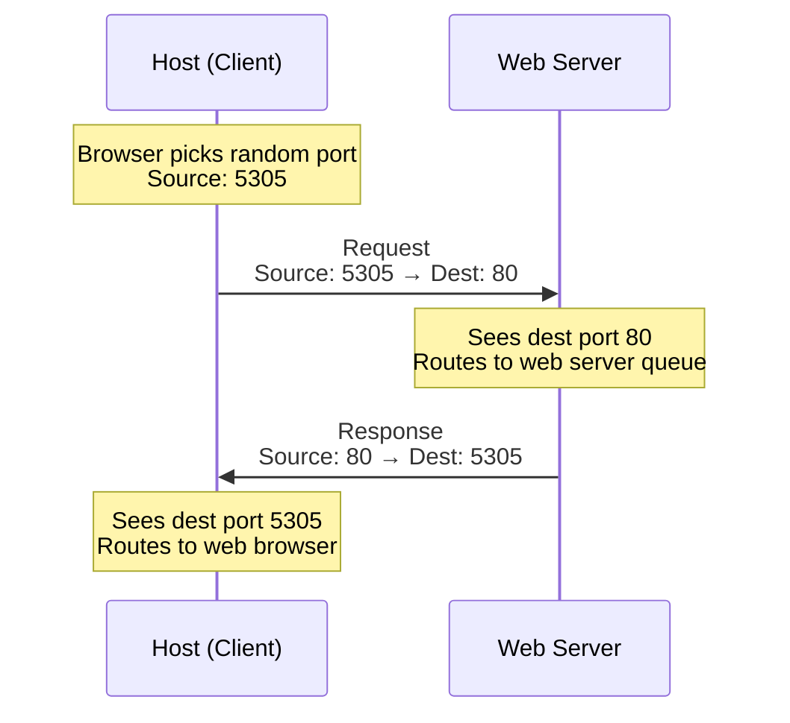

<!-- START doctoc generated TOC please keep comment here to allow auto update -->
<!-- DON'T EDIT THIS SECTION, INSTEAD RE-RUN doctoc TO UPDATE -->
**Table of Contents**  *generated with [DocToc](https://github.com/thlorenz/doctoc)*

- [Transport Layer Port Numbers](#transport-layer-port-numbers)
  - [Server Configuration](#server-configuration)
    - [How Servers Work](#how-servers-work)
    - [Listening Mechanism](#listening-mechanism)
  - [Well-Known Ports (0-1023)](#well-known-ports-0-1023)
    - [Definition](#definition)
    - [Common Well-Known Ports](#common-well-known-ports)
  - [Dynamic/Registered Ports (1024-65535)](#dynamicregistered-ports-1024-65535)
    - [Host Port Assignment](#host-port-assignment)
    - [Port Categories](#port-categories)
  - [Port Communication Flow](#port-communication-flow)
    - [Example: Web Browser Request](#example-web-browser-request)
      - [Step-by-Step Process](#step-by-step-process)
  - [Multiple Simultaneous Connections](#multiple-simultaneous-connections)
    - [How Port Numbers Enable Multitasking](#how-port-numbers-enable-multitasking)
    - [FTP Example Communication Flow](#ftp-example-communication-flow)
  - [Socket Pairs](#socket-pairs)
    - [Definition](#definition-1)
    - [Types of Sockets](#types-of-sockets)
    - [Complete Communication](#complete-communication)
    - [Example](#example)
  - [The `netstat` Command](#the-netstat-command)
    - [Purpose](#purpose)
    - [Basic Usage](#basic-usage)
    - [Understanding Netstat Output](#understanding-netstat-output)
    - [Netstat Options](#netstat-options)
  - [Key Concepts Summary](#key-concepts-summary)
    - [Port Ranges](#port-ranges)
    - [Why Port Numbers Matter](#why-port-numbers-matter)
    - [TCP vs UDP Port Usage](#tcp-vs-udp-port-usage)
  - [Practical Examples](#practical-examples)
    - [Example 1: Web Browsing Session](#example-1-web-browsing-session)
    - [Example 2: Multiple Simultaneous Connections](#example-2-multiple-simultaneous-connections)

<!-- END doctoc generated TOC please keep comment here to allow auto update -->


# Transport Layer Port Numbers


Port numbers are used at the transport layer to:

- **Identify conversations** between devices
- **Distinguish applications** as source and destination
- Enable **multiple simultaneous connections** on a single device
	
<p align="center"><em>Figure 1: Transport Layer Port Numbers</em></p>

---

## Server Configuration

### How Servers Work

When setting up a server to provide network services, applications are loaded with assigned transport layer ports:

```
Server Applications:
├── Web Server → Port 80
├── FTP Server → Port 21
└── Mail Server → Port 25
```

### Listening Mechanism

When a server "listens" on a port:

- It sets up a **buffer** to accept requests
- Requests must be addressed to both:
    - Server's **IP address**
    - Specific **TCP/UDP port number**

> [!example] Multiple Services A server can run multiple services simultaneously (web, FTP, mail) because each service listens on a different port number.

---

## Well-Known Ports (0-1023)

### Definition

**Well-Known Ports**: Port numbers below 1024 that are assigned to common services.

> [!info] Why "Well-Known"? These ports are automatically recognized by client applications. When you type a URL in a browser, you don't need to specify port 80—the browser already knows web servers listen on that port.

### Common Well-Known Ports

|Port|Transport|Service|
|---|---|---|
|20|TCP|FTP - Data|
|21|TCP|FTP - Control|
|22|TCP|Secure Shell (SSH)|
|23|TCP|Telnet|
|25|TCP|SMTP (Simple Mail Transfer Protocol)|
|53|UDP/TCP|DNS (Domain Name Service)|
|67|UDP|DHCP - Server|
|68|UDP|DHCP - Client|
|69|UDP|TFTP (Trivial File Transfer Protocol)|
|80|TCP|HTTP (HyperText Transfer Protocol)|
|110|TCP|POP3 (Post Office Protocol v3)|
|143|TCP|IMAP (Internet Message Access Protocol)|
|161|UDP|SNMP (Simple Network Management Protocol)|
|443|TCP|HTTPS (HTTP Secure)|

---

## Dynamic/Registered Ports (1024-65535)

### Host Port Assignment

- Ports above 1024 are **dynamically assigned** to client applications
- Assignment is **random** from the available range
- Your PC automatically picks a port as the **source port** for outgoing connections

### Port Categories

- **Registered Ports**: 1024-49151 (can be registered with ICANN)
- **Private Ports**: 49152-65535 (often used as dynamic source ports)


<p align="center"><em>Figure 2: Port Number Ranges</em></p>

---

## Port Communication Flow

### Example: Web Browser Request



#### Step-by-Step Process

1. **Client Request**:
    
    - Web browser opens
    - Picks random source port (e.g., 5305)
    - Sends request: `Source: 5305 → Destination: 80`
2. **Server Processing**:
    
    - Sees destination port 80
    - Routes request to web server queue
    - Web server processes request
3. **Server Response**:
    
    - Formulates response
    - Sends back: `Source: 80 → Destination: 5305`
4. **Client Receives**:
    
    - Host sees destination port 5305
    - Routes response to web browser

---

## Multiple Simultaneous Connections

### How Port Numbers Enable Multitasking

> [!example] Running Multiple Applications Your computer can simultaneously:
> 
> - Browse the web (port 5305 → 80)
> - Transfer files via FTP (port 5307 → 21)
> - Check email (port 5308 → 110)
> - All from the SAME IP address!

```
Host Applications:
├── Web Browser:  Source 5305 → Dest 80  (HTTP)
├── FTP Client:   Source 5307 → Dest 21  (FTP)
└── Email Client: Source 5308 → Dest 110 (POP3)
```

### FTP Example Communication Flow

1. **FTP Request**:
    
    ```
    Source: 5307 → Destination: 21
    ```
    
2. **Server sees destination port 21**:
    
    - Routes to FTP server queue
    - FTP server processes request
3. **FTP Response**:
    
    ```
    Source: 21 → Destination: 5307
    ```
    
4. **Host routes to FTP client** based on port 5307
    

---

## Socket Pairs

### Definition

A **socket** is the combination of:

- IP address + Port number

### Types of Sockets

**Source Socket**: Source IP address + Source port number

- Example: `192.168.1.100:5305`

**Destination Socket**: Destination IP address + Destination port number

- Example: `207.138.126.152:80`
### Complete Communication

```
[Segment with ports] → [Encapsulated in IP packet]

IP Packet Contains:
├── Source IP: 192.168.1.100
├── Source Port: 5305
├── Destination IP: 207.138.126.152
└── Destination Port: 80

This creates a unique socket pair that identifies the conversation
```

```bash
Ethernet Frame:
[Preamble][Dest MAC][Source MAC][Type][DATA field][FCS]
                                      ↓
                          This DATA field contains:
                          [IP Header][TCP Header][Application Data]
```

---
### Example 

- **FTP and Web Requests**  
  - A PC generates requests containing **Layer 2 (MAC) and Layer 3 (IP) addresses**.  
  - **FTP request:**  
    - Source port: **1305** (dynamically generated by host)  
    - Destination port: **21** (FTP service)  
  - **Web request:**  
    - Source port: **1099** (dynamically generated by host)  
    - Destination port: **80** (HTTP service)  

- **Sockets**  
  - A socket identifies the combination of **IP address and port number**.  
  - Example client socket: `192.168.1.5:1099`  
  - Example server socket: `192.168.1.7:80`  
  - **Socket pair:** `192.168.1.5:1099, 192.168.1.7:80`  
  - Enables multiple processes on a client to distinguish their connections, and multiple connections to a server process to be tracked separately.  

- **Role of Source Port**  
  - Acts as a **return address** for the requesting application.  
  - The **transport layer** uses it to forward responses to the correct application.


___


## The `netstat` Command

### Purpose

**Netstat** is a network utility used to:

- Verify active TCP/UDP connections
- Identify security threats (unexplained connections)
- Monitor which applications are communicating

### Basic Usage

```bash
C:\> netstat

Active Connections
  Proto  Local Address          Foreign Address        State
  TCP    192.168.1.124:3126     192.168.0.2:139       ESTABLISHED
  TCP    192.168.1.124:3158     207.138.126.152:80    ESTABLISHED
  TCP    192.168.1.124:3159     207.138.126.169:80    ESTABLISHED
  TCP    192.168.1.124:3161     sc.msn.com:80         ESTABLISHED
  TCP    192.168.1.124:3166     www.cisco.com:80      ESTABLISHED
```

### Understanding Netstat Output

|Column|Description|
|---|---|
|**Proto**|Protocol (TCP or UDP)|
|**Local Address**|Your IP:Port|
|**Foreign Address**|Remote IP:Port (or domain:service)|
|**State**|Connection status (ESTABLISHED, LISTENING, etc.)|

### Netstat Options

```bash
# Display numerical form (no name resolution)
netstat -n

# Shows IP addresses and port numbers instead of resolving to domain names
```

> [!tip] Security Use Case Use `netstat` to identify:
> 
> - Unexpected connections to your computer
> - Which applications are actively communicating
> - Potential security threats from unknown connections

---

## Key Concepts Summary

### Port Ranges

|Range|Category|Usage|
|---|---|---|
|**0-1023**|Well-Known Ports|Standard services (HTTP, FTP, SSH, etc.)|
|**1024-49151**|Registered Ports|Registered applications|
|**49152-65535**|Dynamic/Private|Temporary client-side ports|

### Why Port Numbers Matter

1. **Multiplexing**: Multiple applications can use the network simultaneously
2. **Service Identification**: Servers know which application should handle requests
3. **Response Routing**: Responses are directed to the correct application
4. **Session Management**: Each conversation has a unique port pair

### TCP vs UDP Port Usage

> [!note] Dual-Protocol Services Some applications use both TCP and UDP:
> 
> - **DNS** uses UDP for queries (port 53) but can use TCP for zone transfers
> - Communication between DNS servers uses TCP
> - Web browsers use TCP (port 80) for HTTP

---

## Practical Examples

### Example 1: Web Browsing Session

```
Your Computer (192.168.1.100)
    ↓ Request
    Source: 192.168.1.100:5305
    Destination: 207.138.126.152:80
    ↓
Web Server (207.138.126.152)
    ↓ Response
    Source: 207.138.126.152:80
    Destination: 192.168.1.100:5305
    ↓
Back to Your Browser
```

### Example 2: Multiple Simultaneous Connections

```
Your Computer Running:
├── Chrome Tab 1:    Port 5305 ↔ google.com:80
├── Chrome Tab 2:    Port 5306 ↔ youtube.com:443
├── FTP Client:      Port 5307 ↔ ftp.example.com:21
└── Email Client:    Port 5308 ↔ mail.example.com:25

All connections are tracked separately by port numbers!
```

---
